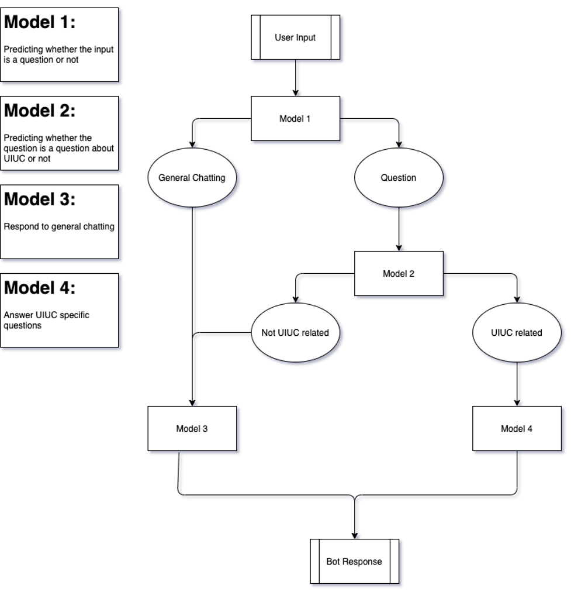
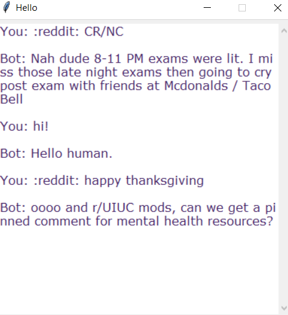

<!-- TABLE OF CONTENTS -->
<details open="open">
  <summary>Table of Contents</summary>
  <ol>
    <li>
      <a href="#about-the-project">About The Project</a>
      <ul>
        <li><a href="#built-with">Built With</a></li>
      </ul>
    </li>
    <li><a href="#usage">Usage</a></li>
    <li><a href="#acknowledgements">Acknowledgements</a></li>
  </ol>
</details>

<!-- ABOUT THE PROJECT -->
## About The Project



A beginner project to build a Q&A chatbot that is able to answer questions about UIUC. A chat interface allows users to ask questions or just chat with the bot.

The project is incomplete and can be improved in a variety of ways. For example, Model 1 and 2 uses only words and bigrams as tokens instead of extracting semantic meaning. Model 3 could be improved by having a model that auto-generates responses instead of pulling from a fixed pool of resonses. Finally, model 4 could be improved by using a more deep-learning approach to extract answers from text banks.

Overall, all 4 models can also be improved by simply collecting more data.

A list of used resources are listed in the acknowledgements.

### Usage

Install requirements:
```
pip install requirements.txt
```

Train the models:
```
cd python-project-chatbot-codes
python3 train_chatbot.py
python3 model2_train.py
```

Activate the chat GUI:
```
python3 chatgui.py
```




### Built With

Python using Tensorflow, sci-kit learn, Whoosh, tkinter

## Acknowledgements
* [Model 3 tutorial](https://towardsdatascience.com/how-to-create-a-chatbot-with-python-deep-learning-in-less-than-an-hour-56a063bdfc44 )
* [Whoosh Docs](https://whoosh.readthedocs.io/en/latest/index.html)
